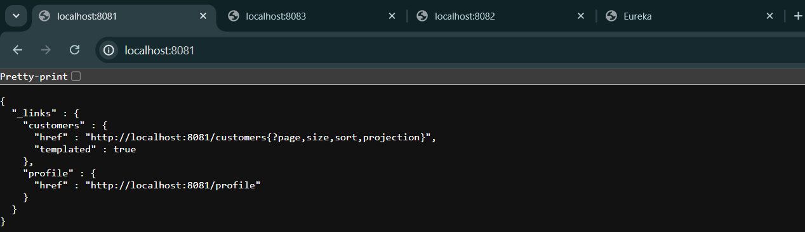
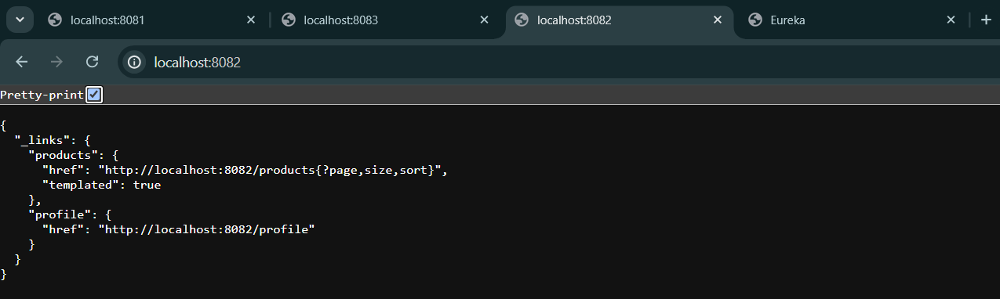
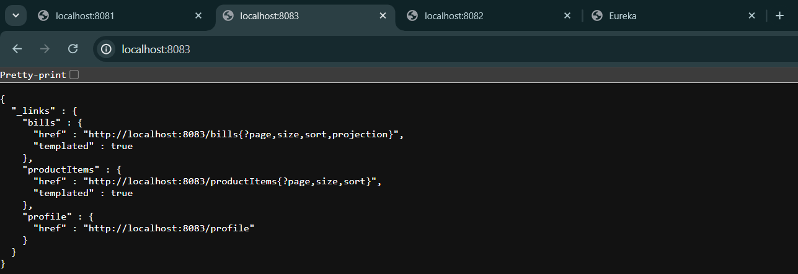

<h1>Projet de système de gestion de micro-services</h1>

  <h2>Objectif du projet</h2>
  
Le projet vise à développer un système de gestion de micro-services pour une entreprise, comprenant la gestion des clients, des produits, des factures et une passerelle (Gateway) pour la gestion des routes entre les services. L'objectif principal est de démontrer une architecture basée sur les micro-services en utilisant des technologies modernes telles que Spring Cloud, Eureka, OpenFeign et Angular.

  <h2>Description des micro-services</h2>
  <ol>
    <li><strong>Customer-Service :</strong> Ce micro-service est responsable de la gestion des clients. Il permet de créer, mettre à jour, supprimer et récupérer des informations sur les clients.
    </li>
    <li><strong>Inventory-Service :</strong> Ce micro-service gère les produits en stock. Il offre des fonctionnalités telles que l'ajout de produits, la mise à jour des quantités en stock, la récupération des détails des produits, etc.
    </li>
    <li><strong>Billing-Service :</strong> Ce micro-service est chargé de la facturation des clients. Il communique avec les autres micro-services pour récupérer les détails des produits achetés et générer des factures pour les clients.
    </li>
  </ol>

  <h2>Configuration et gestion des services</h2>
  <ol>
    <li><strong>Spring Cloud Gateway :</strong> Une passerelle est mise en place pour gérer le routage des requêtes entre les différents micro-services. Cela permet d'abstraire les détails de la localisation des services pour les clients et de fournir une couche de sécurité supplémentaire.</li>
    <li><strong>Configuration statique :</strong> Initialement, la configuration statique est utilisée pour définir les routes entre les services dans la Gateway.</li>
    <li><strong>Eureka Discovery Service :</strong> Un service d'annuaire Eureka est mis en place pour permettre aux micro-services de s'enregistrer et de découvrir les autres services disponibles dans le système. Cela permet une configuration dynamique des routes de la Gateway.
    </li>
  </ol>

  <h2>Intégration des services</h2>
  <ol>
    <li><strong>OpenFeign :</strong> OpenFeign est utilisé pour faciliter l'intégration entre les micro-services. Le service de facturation communique avec les services client et inventaire pour récupérer les informations nécessaires à la facturation.</li>
  </ol>

  <h2>Interface utilisateur</h2>
  
Un client Web Angular est développé pour permettre aux utilisateurs d'interagir avec le système. Il offre des fonctionnalités pour la gestion des clients, des produits et des factures.
